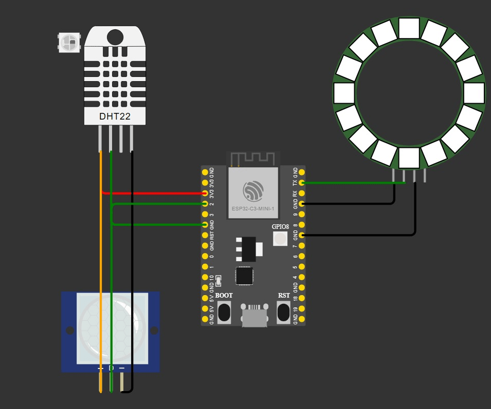

# ESP32 Wetterstation – Variante 4: RGB Colorpicker
von Arslan und Mehuric

## Projektbeschreibung:

Dieses Projekt ist eine einfache Wetterstation mit einem ESP32. Sie misst Temperatur und Luftfeuchtigkeit mit dem Sensor DHT11. Die Messdaten werden auf einer eigenen Webseite dargestellt. Dort können Benutzer auch die Farben der Statusanzeige (RGB-LED) über einen Colorpicker auswählen und dauerhaft speichern. Die Messungen werden regelmäßig durchgeführt, mit Zeitstempel versehen und gefiltert (Durchschnitt, Ausreißer ignorieren). Die Uhrzeit wird per Internet synchronisiert.

## Funktionen:

Temperatur- und Luftfeuchtigkeitsmessung (DHT11)

Mittelwertbildung aus mehreren Messungen

Ausreißerfilterung (z. B. unrealistisch hohe Werte werden ignoriert)

Zeitstempel zu jeder Messung 

Anzeige der Daten auf einem Webinterface

RGB-LED zeigt Status der Wetterstation an:

Rot: Kein WLAN

Blau: Messung läuft

Orange: Temperatur zu hoch

Webinterface enthält einen Colorpicker zur Auswahl der Farben für die RGB-LED

Farbwahl wird dauerhaft gespeichert (auch nach Neustart)


## Hardware:

   ESP32 Mikrocontroller
DHT11 Sensor

RGB-LED 

Vorwiderstände für LED

Breadboard, Steckkabel

USB-Kabel zur Stromversorgung


## Schaltplan:

Der Schaltplan wurde mit  Wokwi erstellt. Enthalten sind:

  Anschlüsse für DHT11

RGB-LED mit Vorwiderständen

Verbindung zum ESP32



## Webinterface:
Zeigt Temperatur, Luftfeuchtigkeit, zweiten Sensorwert und Zeitstempel an

Bietet einen Colorpicker zur Auswahl der Farben für die Status-LED

Übernimmt neue Farbwerte und speichert diese im Flash-Speicher

Nach einem Neustart werden die gespeicherten Farben automatisch geladen

## Software:

Verwendung von Arduino IDE
Bibliotheken:

  DHT.h für den Sensor
WiFiManager.h für WLAN-Verbindung

ESPAsyncWebServer.h und AsyncTCP.h für den Webserver

Preferences.h für die dauerhafte Speicherung der Farbeinstellungen

HTML-Datei für das Webinterface mit JavaScript zur Farbauswahl

Webserver liefert die Webseite, verarbeitet Farbwünsche und gibt aktuelle Messwerte aus

Messintervall und Datenverarbeitung:

Alle 30 Sekunden wird eine neue Messung gestartet

Pro Messung: 10 Werte erfassen und mitteln

Extremwerte werden ignoriert (z. B.  80 °C)

Jeder Messwert wird mit Zeitstempel versehen
Farbauswahl und LED-Statusanzeige:
Jeder Betriebszustand (z. B. „kein WLAN“) bekommt eine eigene Farbe

Farben werden über Webinterface gewählt

Einstellungen werden in Preferences gespeichert und nach Neustart wiederverwendet

Status wird durch LED-Farbe dargestellt


Arduino Code:
```csharp
/*
 * This ESP32 code is created by esp32io.com
 *
 * This ESP32 code is released in the public domain
 *
 * For more detail (instruction and wiring diagram), visit https://esp32io.com/tutorials/esp32-web-server
 */

#include <WiFi.h>
#include <ESPAsyncWebServer.h>
#include "index.h"  // Include the index.h file

#include "DHT.h"
#include "DHT_U.h"

#include <Adafruit_NeoPixel.h>

#define PIN         8
#define NUMPIXELS   1

Adafruit_NeoPixel pixels(NUMPIXELS, PIN, NEO_GRB + NEO_KHZ800);

//const char* ssid = "IOT"; // CHANGE IT
//const char* password = "20tgmiot18"; // CHANGE IT

const char* ssid = "Schnoppelnetz"; // CHANGE IT
const char* password = "Schnoppel01170327"; // CHANGE IT

AsyncWebServer server(80);

DHT dht(2, DHT11);
int inputPin = 0;

class Messung{
  public: 
    int time;
    float temp;
    float humidity;
    bool vibration;
    Messung(){
      //setStatus(2);
      time = millis()/1000;
      temp = dht.readTemperature();
      humidity = dht.readHumidity();
      vibration = false;
      //setStatus(1);
    }
};

Messung m[3] = {{}, {}, {}};
int await;

void setup() {

  //init Status LED
  pixels.begin();
  setStatus(1);
  Serial.begin(9600);

  pinMonde(inputPin, INPUT_PULLDOWN);
 

  // Connect to Wi-Fi
  WiFi.begin(ssid, password);
  while (WiFi.status() != WL_CONNECTED) {
    delay(1000);
    Serial.println("Connecting to WiFi...");
  }
  Serial.println("Connected to WiFi");
  setStatus(0);

  // Print the ESP32's IP address
  Serial.print("ESP32 Web Server's IP address: ");
  Serial.println(WiFi.localIP());

  // Serve the HTML page from the file
  server.on("/", HTTP_GET, [](AsyncWebServerRequest* request) {
    Serial.println("ESP32 Web Server: New request received:");  // for debugging
    Serial.println("GET /");                                    // for debugging

    request->send(200, "text/html", webpage);
  });

  Serial.println(dht.readTemperature());
  

  // Define a route to get the temperature data
  server.on("/temperature", HTTP_GET, [](AsyncWebServerRequest* request) {
    setStatus(2);
    //Serial.println("ESP32 Web Server: New request received:");  // for debugging
    //Serial.println("GET /temperature");                         // for debugging
    //float temperature = dht.readTemperature();
    float temperature = getTemperature();
    String temperatureStr = String(temperature, 2);
    request->send(200, "text/plain", temperatureStr);
    setStatus(0);
  });

  server.on("/humidity", HTTP_GET, [](AsyncWebServerRequest* request) {
    setStatus(2);
    //Serial.println("ESP32 Web Server: New request received:");  // for debugging
    //Serial.println("GET /temperature");                         // for debugging
    float humidity = getHumidity();
    String humidityStr = String(humidity, 2);
    request->send(200, "text/plain", humidityStr);
    setStatus(0);
  });

  server.on("/uptime", HTTP_GET, [](AsyncWebServerRequest* request) {
    float time = millis()/1000;
    String uptime = String(time, 2);
    request->send(200, "text/plain", uptime);
  });

  server.on("/setLED", HTTP_GET, [](AsyncWebServerRequest *request){
    Serial.println("set led bekommen");
  if (request->hasParam("id")) {
    String sid = request->getParam("id")->value();
    String r = request->getParam("r")->value();
    int id = sid.toInt();
    String g = request->getParam("g")->value();
    String b = request->getParam("b")->value();
    
    
    color[id][0] = r.toInt();
    color[id][1] = g.toInt();
    color[id][2] = b.toInt();
    setStatus(id);
    request->send(200, "text/plain", "Received: ");
  }
  });
  // Start the server
  server.begin();
}

void loop() {
  
  if(millis() > await){
    int id = 0;
    for(int i = 0; i < 3; i++){
      if(m[i].time < m[id].time) id = i;
    }
    m[id].time = millis();
    m[id].temp = dht.readTemperature();
    m[id].humidity = dht.readHumidity();
    m[id].vibration = digitalRead(inputPin);
    await = millis()+5000;
  }

}

void setStatus(int id){
  pixels.setPixelColor(0, pixels.Color(color[id][0], color[id][1], color[id][2])); 
  pixels.show();
}

float getTemperature(){
  float temp = 0;
  int l = 0;
  for(int i = 0; i < 3; i++){
    if(m[i].temp < 50 && m[i].temp > 0){
      temp += m[i].temp;
      l++;
    }
  }
  temp /= l;
  return temp;
}

float getHumidity(){
  float h = 0;
  int l = 0;
  for(int i = 0; i < 3; i++){
    if(m[i].humidity < 100 && m[i].humidity > 0){
      h += m[i].humidity;
      l++;
    }
  }
  h /= l;
  return h;
}
```
und das ist html:
```html
/*
 * This ESP32 code is created by esp32io.com
 *
 * This ESP32 code is released in the public domain
 *
 * For more detail (instruction and wiring diagram), visit https://esp32io.com/tutorials/esp32-web-server
 */

#ifndef WEBPAGE_H
#define WEBPAGE_H

/* 
 * [0] -> online
 * [1] -> no WLAN/Offline
 * [2] -> taking measurements
 */
short color[3][3] = {{0, 150, 0}, {150, 0, 0}, {150, 100, 0}}; 

const char* webpage = R"=====(
<!DOCTYPE html>
<html>
<head>
    <title>ESP32 Temperature</title>
</head>
<body>
    <h1>ESP32 Temperature</h1>
    <p>Temperature: <span style="color: red;"><span id="temperature">Loading...</span> &#8451;</span></p>
    <p>Uptime: <span style="color: red;"><span id="uptime">Loading...</span> Sekunden</span></p>
    <p>Humidity: <span style="color: red;"><span id="humidity">Loading...</span>%</span></p>

    <label for="on">Status ON:</label>
    <input type="color" id="on" value="#ff0000">

    <label for="off">Status no WLAN:</label>
    <input type="color" id="off" value="#ff0000">

    <label for="messen">Status es wird gemessen:</label>
    <input type="color" id="messen" value="#ff0000">


    <script>
      
      const on = document.getElementById("on");
      const off = document.getElementById("off");
      const messen = document.getElementById("messen");

        function fetchTemperature() {
            fetch("/temperature")
                .then(response => response.text())
                .then(data => {
                    if(!isNaN(data)){
                      document.getElementById("temperature").textContent = data;
                      console.log(data);
                    }
                });
        }

        function fetchUptime() {
            fetch("/uptime")
                .then(response => response.text())
                .then(data => {
                    if(!isNaN(data)){
                      document.getElementById("uptime").textContent = data;
                    }
                });
        }
        function fetchHumidity() {
            fetch("/humidity")
                .then(response => response.text())
                .then(data => {
                    if(!isNaN(data)){
                      document.getElementById("humidity").textContent = data;
                    }
                });
        }

        fetchTemperature();
        setInterval(fetchTemperature, 4000); // Update temperature every 4 seconds
        setInterval(fetchUptime, 4000);
        setInterval(fetchHumidity, 4000);


        function submitClicked(){
          sendColor(on.value, 0);
          sendColor(off.value, 1);
          sendColor(messen.value, 2);
        }

        function sendColor(hex, id){
          //let hex = on.value;
          
          const r = parseInt(hex.slice(1, 3), 16); // "ff" → 255
          const g = parseInt(hex.slice(3, 5), 16); // "88" → 136
          const b = parseInt(hex.slice(5, 7), 16); // "44" → 68
          let url = "/setLED?id=" + id + "&r="+ r + "&b=" + b + "&g=" + g;
          console.log(url);
          fetch(url);
        }
    </script>

    <button id="submit" onclick="submitClicked()">submit</button>
</body>
</html>
```
